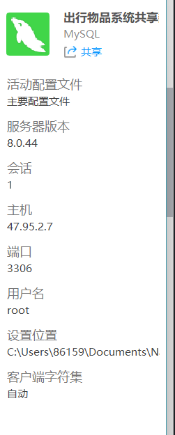

# 星溯智语 EduAI 智能体教育平台

> **面向高校教育的 AI 智能体工作台**
>
> *赋能教师快速构建 AI 助教，助力学生个性化学习体验*

## 🛠️ 技术栈概览

| 层级               | 技术组件   | 版本/说明               |
| ------------------ | ---------- | ----------------------- |
| **后端**     | Java       | JDK 17+                 |
|                    | Framework  | Spring Boot 3.2.0       |
|                    | ORM        | MyBatis-Plus 3.5.5      |
|                    | Database   | MySQL 8.0               |
| **前端**     | Framework  | Vue 3.5 + TypeScript    |
|                    | Build Tool | Vite 5.x                |
|                    | UI Library | Element Plus            |
|                    | State      | Pinia                   |
| **基础设施** | Container  | Docker & Docker Compose |

---

## 🚀 快速开始 (Quick Start)

### 1. 环境准备 (Prerequisites)

请确保开发环境中已安装以下工具：

- **Java JDK 17+**: `java -version`
- **Node.js 18+**: `node -v`
- **Maven 3.6+**: `mvn -v`
- **MySQL 8.0+**: (如果不是用 Docker 启动数据库)

### 2. 数据库配置

推荐使用 Docker 快速启动数据库：

```bash
cd docker
docker-compose up -d
```

如果不使用 Docker，请手动配置 MySQL：

1. 创建数据库 `eduai`
2. 导入架构脚本: `backend/src/main/resources/schema.sql`
3. 导入初始数据: `backend/src/main/resources/data.sql`
4. 修改 `backend/src/main/resources/application.yml` 中的数据库连接信息。
5. 
6. 密码：767867/WBw

### 3. 启动后端服务

```bash
cd backend

# 安装依赖并编译
mvn clean install

# 启动服务
mvn spring-boot:run
```

- 服务默认端口: `8080`
- API 文档地址: `http://localhost:8080/swagger-ui/index.html` (如果有集成Swagger)
- 健康检查: `http://localhost:8080/actuator/health`

### 4. 启动前端应用

打开新的终端窗口：

```bash
cd frontend

# 安装依赖
npm install

# 启动开发服务器
npm run dev
```

- 访问地址: `http://localhost:5173`

---

## 📁 项目目录结构

```
StarTraceSmartTalkEduAI/
├── backend/               # SpringBoot 后端工程
│   ├── src/main/java/com/eduai/
│   │   ├── controller/    # API 接口层
│   │   ├── service/       # 业务逻辑层
│   │   ├── mapper/        # 数据持久层
│   │   └── entity/        # 数据库实体
│   └── src/main/resources/
│       ├── application.yml # 配置文件
│       └── schema.sql      # 数据库初始化脚本
│
├── frontend/              # Vue 3 前端工程
│   ├── src/
│   │   ├── views/         # 页面视图 (CourseView, TemplateView等)
│   │   ├── components/    # 公共组件
│   │   ├── api/           # Axios 请求封装
│   │   └── stores/        # Pinia 状态管理
│   └── vite.config.ts     # Vite 配置
│
├── docs/                  # 项目文档
│   ├── members/           # 成员任务书
│   └── designs/           # 详细设计文档
└── docker/                # 部署配置
```

---

## 🤝 协作指南

### 成员分工

请根据分配的任务书进行开发：

| 成员            | 职责            | 任务入口                                               |
| --------------- | --------------- | ------------------------------------------------------ |
| **成员A** | 前端开发 (Vue)  | [MEMBER_A_FRONTEND.md](docs/members/MEMBER_A_FRONTEND.md) |
| **成员B** | 后端开发 (Java) | [MEMBER_B_BACKEND.md](docs/members/MEMBER_B_BACKEND.md)   |
| **成员C** | 测试与文档      | [MEMBER_C_TEST.md](docs/members/MEMBER_C_TEST.md)         |

### 代码提交规范

- **feat**: 新功能
- **fix**: 修复 Bug
- **docs**: 文档修改
- **style**: 格式调整（不影响代码运行）
- **refactor**: 重构（即不是新增功能，也不是修改bug的代码变动）

示例: `feat: 添加课程列表 API`

---

## ❓ 常见问题 (Troubleshooting)

**Q: 启动后端时提示 "Access denied for user 'root'@'localhost'?"**
A: 请检查 `application.yml` 中的数据库密码是否与本地 MySQL 设置一致。

**Q: 前端请求 API 报 404?**
A: 请确保后端服务已启动，且 `vite.config.ts` 中的代理配置正确指向了 `http://localhost:8080`。

**Q: 模块引用报错?**
A: 请确保在项目根目录下执行过 `mvn clean install` (后端) 或 `npm install` (前端) 以加载最新依赖。
